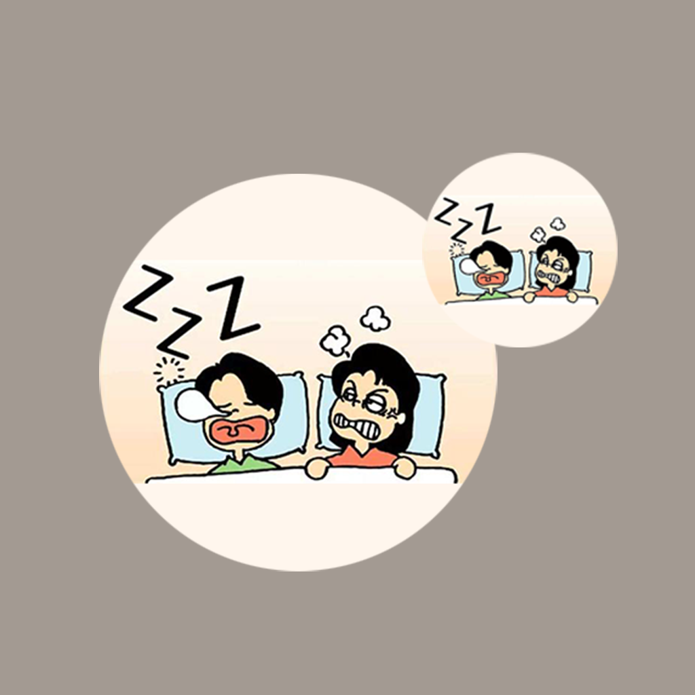

## Welcome to Family Bad Snoring Habit Record

In our daily life, our family members often form a bad habit of snoring. Some even snore loudly, which affects the sleep of children or other family members. In order to minimize the adverse effects of this bad habit, we can record the number of snoring times, the volume of snoring and your feelings of each family member who snores. In this way, we can clearly understand the sleep status of each family member, help them get rid of this bad habit, and make family members have a better sleep environment.

If you have any questions, you can either leave a message or send the questions to our email address.

We will answer them for you in the first time.

### Address: BeatriceArlenexSgPdE@yahoo.com

Thank you!
